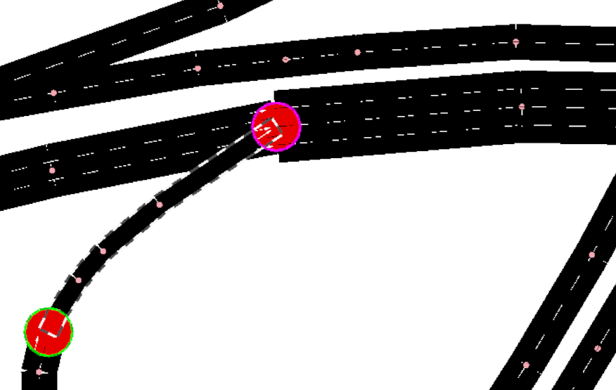

Installing sumo  
Example simulation osm->netconvert->trips->routes->simulations  
Exploring the net edit  
    Ramps guessing does work  
          
        
Batch script to create network from osm files from any configuration in any folder
Examined and manually listed which types of links are present in the target road segment
Obtained first highway only (but with some excess) network file
./VCI/vci_netconvert.bat