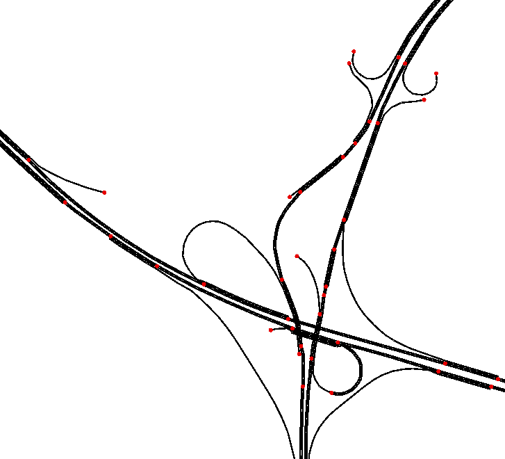
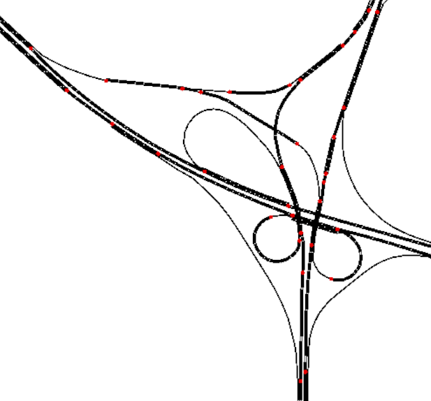
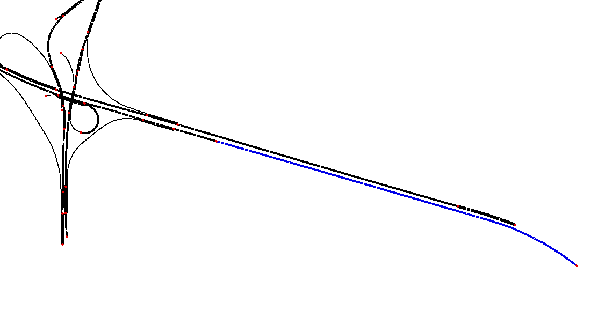
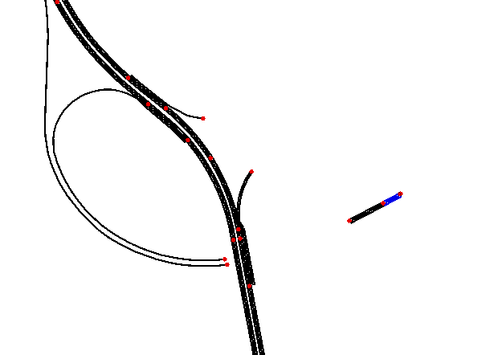
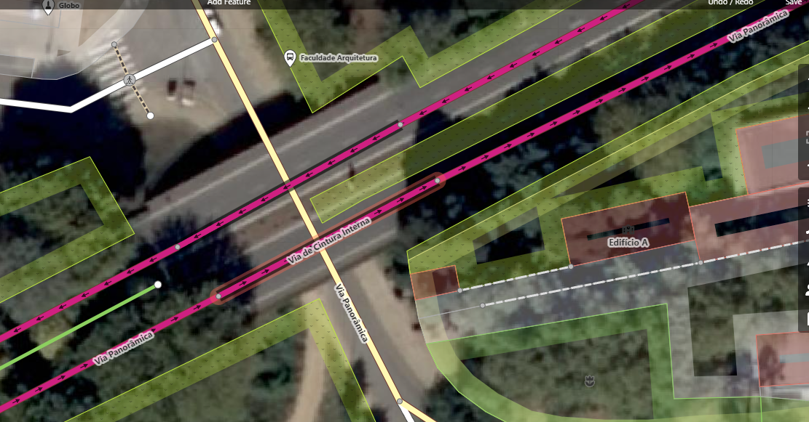

Going to switch to .py instead of .bat for scripts
Managed to get filter edges to work on the script.
    Got a good result but not perfect
        In "No de coimbroes" and "Nó do Areinho", the filter used deletes the connection betweeh the indirect branches of VCI (You go to an interchange to keep on the VCI)
            
            
        Can simply add the name of the branches to the filter
        Also, getting some extents of road that are not of VCI exactly due to that (keep going forward will change the road (the name of the road changes))
            
        Just 1 hierarchy for link might be too low. Increasing might fix the above problems AND might result in more realistic traffic at exits 
        Also, there is an isolated piece of road. I can turn on junctions and it should get rid of it? That or maybe just keep the biggest connected component
            Actually, it's because there is a bit of road that has the wrong name: Important for the results
            
            
Explored OSM
netconvert doesn't both save the configuration file and does what we asked it to do!!!
Finished automating creation
Created a good network that seems to have everything (in a replicable manner)
Download of some demographic documents and data (censos from INE) with the intention of making a traffic demand model