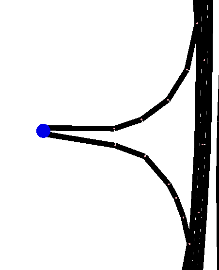

Some investigation on Traci and detectors (Youtube)
Dynamic use of .osm files in osm_netconvert script
Gathering some (little) papers/information on traffic demand of Porto
    Just for public transit or from GPS traces apparantely
Trying to figure out the entries and exits of the system (intuitively, these are the highway entrances and exits).
    Not trivial in netsumo
    Check the junctions that have no connections (eventually check for the existing connections of the in and out edges if that's not enough) which would mean one must necessarily enter or exit the system
        type dead_end junction
            seeing which have no incoming or no outgoing is not enough
            
    For a say, dead-end road, you could probably circle back and the end of the road junction would have a connection, making it not an entry or exit
    Note, demand coming from edges is still possible within sumo. These just dictate entries and exits of the overall system (take like in city skylines where you have to connect your city to the highway)
Creating the script to get the entries and exits of the system
Reading more on additionals from the page https://sumo.dlr.de/docs/Netedit/elementsAdditional.html
Running a small simulation on VCI with some detectors an calibrators
    Only detectors output information
    Calibrators appear for control of traffic only
    