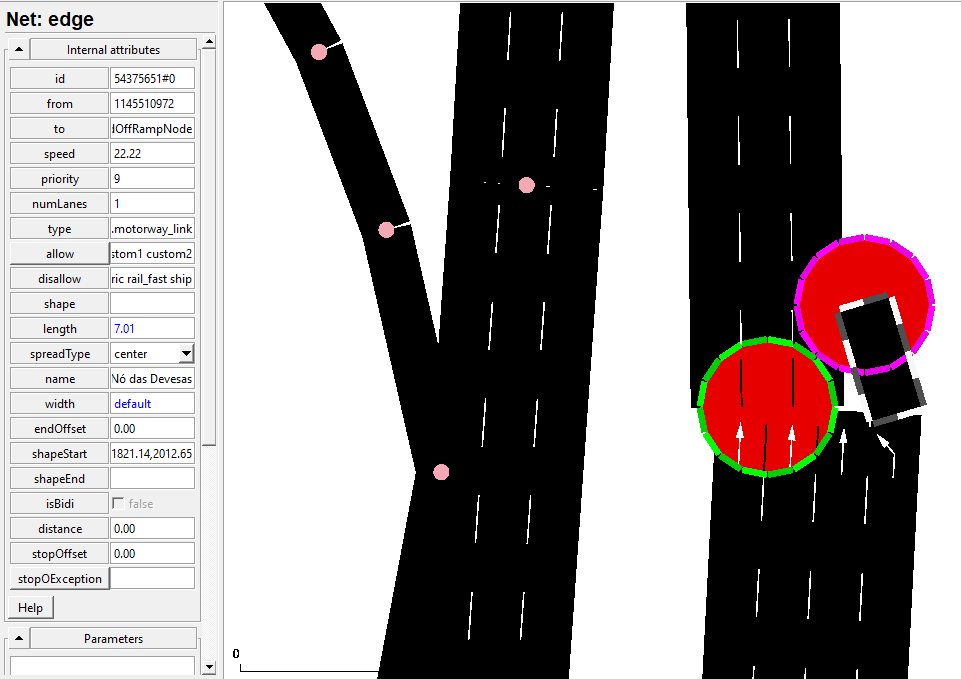

Investigated calibrator pos: Netedit throws an error when it exceeds edge length
Still investigating the length error, we found that there was a lane whose length obtained through the .getLenght() function was in agreement with its actual length when opening in netedit.
    
    Definition in .net.xml
        ```    
        <edge id="54375651#0" from="1145510972" to="54375651#0-AddedOffRampNode" name="Nó das Devesas" priority="9" type="highway.motorway_link" spreadType="center" shape="1821.14,2012.65 1819.15,2019.37">
        <lane id="54375651#0_0" index="0" allow="private emergency authority army vip passenger hov taxi bus coach delivery truck trailer motorcycle evehicle custom1 custom2" speed="22.22" length="26.46" shape="1826.66,1994.00 1819.15,2019.37">
            <param key="origId" value="54375651"/>
        </lane>
        </edge>
        ```  
    Tracing the problem back, it was concluded that the option ramps.guess=true in the config for the osm conversion was the problem.
        It created a netfile where the edge was not contained inside of the edge.
    As a solution, turning this setting off yielded overall better results, since the osm source is well made and already accounts for ramps
Was still getting errors with one calibrator
    After investigation, it was a similar problem. This time the length had a certain length but the pathable edge didn't go so far, so the calibrator couldn't be position inside the bounds of the network.
        
    It turns out that the junctions.join=true parameter in the config for the osm conversion was the problem.
    As a solution, turning this setting off solved that problem
Managed to get a good layout of VCI with good junctions
Calibrators can be used to remove excess traffic flow. however, it might be more than what is needed at exit connections. Maybe a vaporizer would be enough. Should adapt the scripts to differentiate entry from exit junctions both when adding the additionals and fetching the junctions
    Don't forget that there can be connections that are both entry and exit
Every entry and exit have calibrators
    Exit calibrators might not be needed after all
Taking some inspiration from the [other vci work](https://repositorio-aberto.up.pt/bitstream/10216/153832/2/647753.pdf)
Added counters on junctions with different number of edges (edges in which the flow can be affected)
    
There is a limit to the number of additional files that can be open. Therefore, all counters will write to the same file
Divided between counter and calibrator additionals
Was able to run a simulation with and without gui through traci