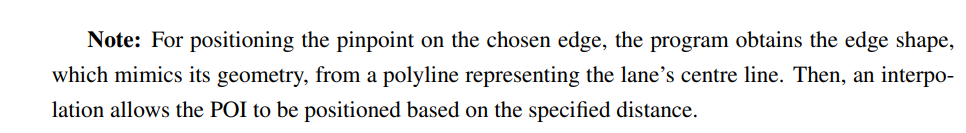

Started reading more in depth the work done by my colleague
    He hints at equations being at the lane level not at the edge level
        Detectors irl are also probably at the lane level
        Accounts for continuous lines before a split 
    There are GUI settings
    Distance calculation from edge geometry and not length attribute (probably avoids the previous length problems that were encountered)
        
Learnt a new netcovnert option that could have helped with the lenght problem
   `--plain.extend-edge-shape <BOOL>: If edge shapes do not end at the node positions, extend them; default: false`

Analysed how white continuous line work
    In the GUI a yellow continuous line indicates when crossing is not allowed.
    In the .net.xml file
        changeLeft and changeRight attributes are used to restrict the types of vehicles that can make that transtition.
            Second lane cannot cross to third (changeleft)
                ```<lane id="479198379_1" index="1" disallow="pedestrian bicycle tram rail_urban rail rail_electric rail_fast ship" speed="25.00" length="40.43" acceleration="1" shape="2902.28,7221.93 2899.77,7262.28" changeLeft="authority">```
            Third lane cannot cross to second (change right) and cannot go out of bounds (change left)
                ```<lane id="479198379_2" index="2" disallow="pedestrian bicycle tram rail_urban rail rail_electric rail_fast ship" speed="25.00" length="40.43" shape="2899.09,7221.73 2896.57,7262.08" changeLeft="authority" changeRight="authority">
            ```
    you can also have changing in only one direction (two yellow lines, one continuous one interrupted)
    if you set up in netedit to disallow every vehicle, the .net.xml doesn't add any new information and reloading will view the prohibitions removed (bug probably)
        Known issue https://github.com/eclipse-sumo/sumo/issues/14127
Analysed a little bit how connected components work. Even if a edge has restricted lane transtitions (for all but one type of vehicles) it will still count as giving access to the two sides of the same connection. 
    For example, if there are, A, B(B1,B2), C, and you cannot go from B1 to B2, such that A->B1->A and C->B2->C, there is still only one connected component
    Would need to manually implement connected component functions if I want lane transitions prohibitions to separate systems (even though edge with multiple lanes probably have detectors along every single one)
We assume that if a edge has connectors, all lanes have connectors
Traffic flow on an edge can be expressed in relation to the flow of incoming edges.
    An abstraction of this would be equations, in which each variable represents the flow of an edge.
    We have known and unknown variables, meaning edges with detectors and without detectors.
    If we remove the edges with known flows from the system (cut edges), we are left with multiple weak components. [script](./src/VCI/cut_systems.py)
        Each component is an independent system for which the rest of the network doesn't matter. Effectively we are simulation multiple smaller networks. 
        TODO / ISSUE / QUESTION: How is the fact that the component are weakly connected vs strongly connected affect what we can in fact partition and simplify (in terms of needed equations?)
    We can then extract each components (detector system) and inference the equations that represent said system [script](./src/vci/detector_systems)
We can go one step further with the simplifications.    
    We can increase the number of edges that are removed, and therefore, decreasing the number of edges of the detector systems if we introduce the concept of continuity.
    In netsumo, two different edges might be created if the number of lanes changes. Therefore, there can be junctions, where the vehicles will never change edge. These are called two continuous edges (A is continuous to B)
    Then we can remove not only the cut edges, but also the edges that each cut edge is continuous to or continuous from.
        The algorithm to do this is a recursive algorithm
        For each edge check the to and from node.
        In general, if the number of incoming and outgoing edges of a node are both equal to 1 (or smaller than 1), then the 2 edges are continuous (or an entry/exit node)
This approach is not perfect
    TODO / ISSUE / QUESTION: Say if you have a complex 4-way junction, in which vehicles can only go forward. Edges will still be continuous. This would require a more cmoplext approach to compute those by looking at connections and allowed turns/directions of travel. We will ignore this as VCI doesn't have any such cases.
We can make yet another distinction. That of unknown deducible and unknown undeducible flows.
    In order to get the deducible, one need not only look at the amount of incoming and outgoing edges of a node, but if those incoming/outgoing are themselves deducible or known it becomes a deducible themselves.
    This can also be done recursively
In the end, those edges that remain are the unknown undeducible flows, which we must "guess". These will still be in a system, expressing them in function of another.
In the end, edges with knowable flows (including continuous) are candidates to allow for paralelization.
    At the entry/exits of each parallel system, the information about the vehicles would need to be passed to the other system

