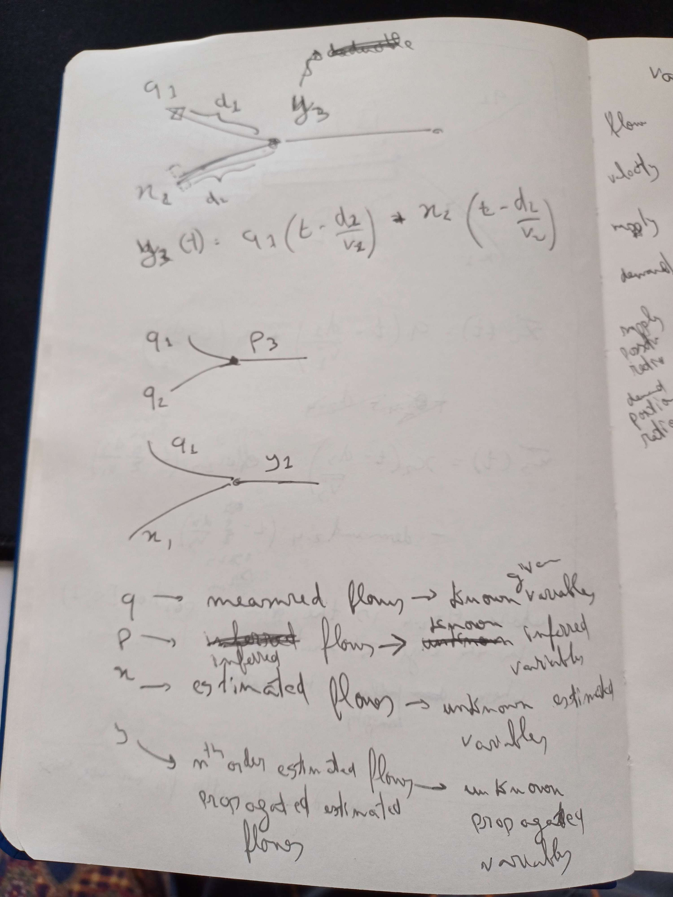
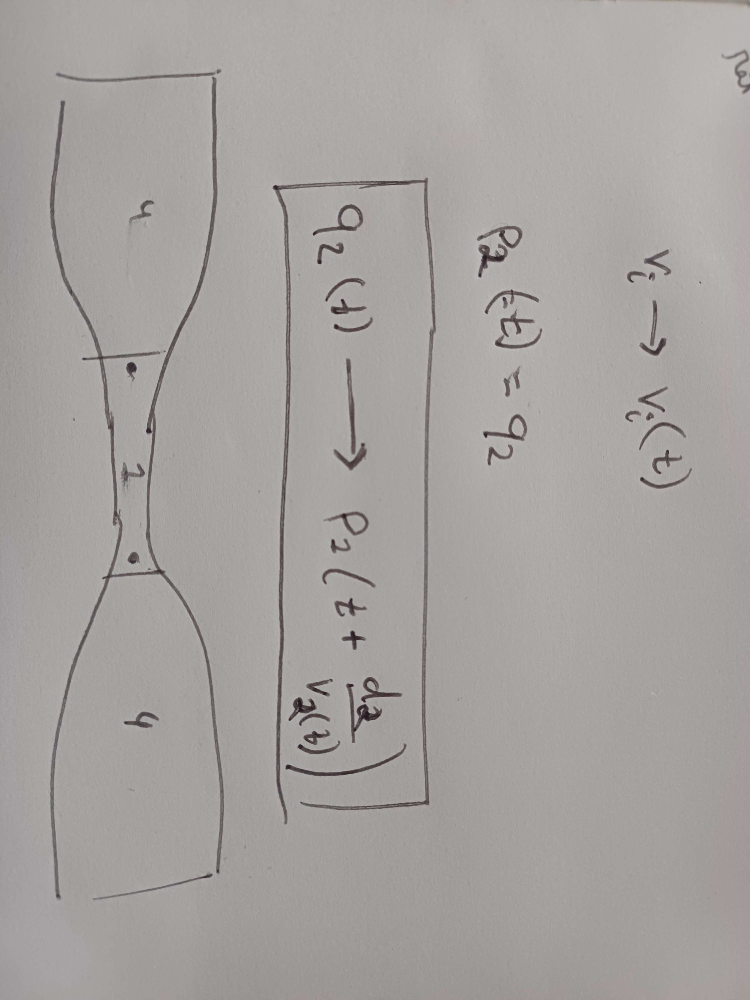
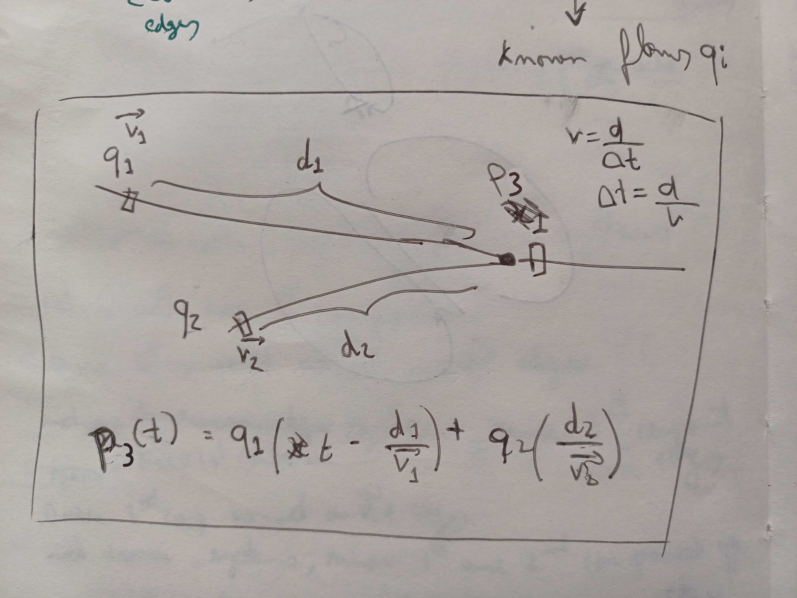
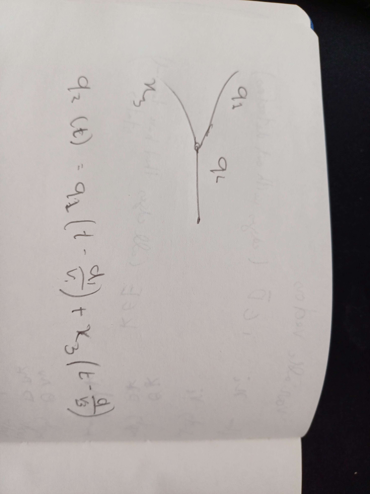
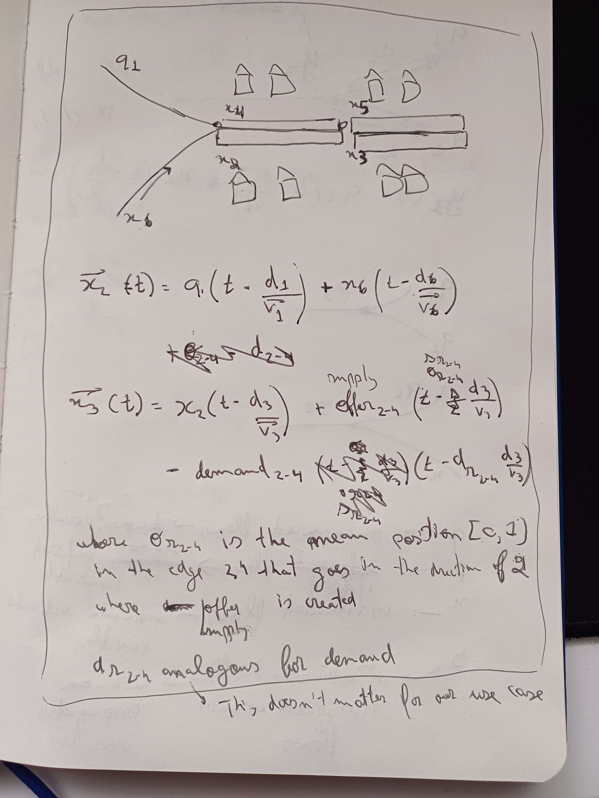

Flow equations
    Definitions
        q_k: measured flow: known given varible
        p_k: inferred flow: known inferred variable
        x_i: estimated flow: unknown estimated variable
        y_i: inferred estimated flow, when a flow is affected both by known and unknown flows: unknown inferred variable
        Continuous edges: Two edges are continuous if vehicles cannot choose another edge at the junction
        Continuous segments: Set of consecutive continuous edges.  
        d_r_i-j: Mean position ratio \[0,1\] where the demand in the pair of edges i and j (where i and j are the same road but in opposite headings) is created: unknown estimated variable
        s_r_i-j: : unknown estimated variable
          
    1. For systems in which there are no edges with terminal states (cars don't spawn or disappear inside of the edge, only at the nodes)    
        1.
        The flow on the continuous edge  is equal to what the flow at the previous edge was an amount of time equal, by approximation, derived from the lenght of the edge and its velocity
        q1-d1->p2
        p2(t) = q1(t - d1/v1)
          
        2.
        q1-d1->p1; q2-d2->p3
        p3(t) = q1(t - d1/v1) + q2(t - d2/v2)                  
          
        3.
        q1-d1->q2
        x3-d3->q3
        q2(t) = q1(t-d1/v1) + x3(t-d3/v3)  
          
        4.
        q1-d1->y3
        x2-d2->y3
        y3(t) = q1(t - d1/v1) + x2(t - d2/v2)
    2. For systems with edges where vehicles can go to and come from, meaning edges with supply and demand.
        q1-d1->x2; 
        x6-d6->x2;
        x2-d2->x3;
        x5-d5->x4;
        x4-d4->q1;
        x4-d4->x6;
        x2(t) = q1(t - d1/v1) + x6(t - d6/v6)
        x3(t) = x2(t - d3/v3) + supply2-4(t - s_r_2-4 * d3/v3) - demand2-4(t - d_r_2-4 * d3/v3)
         
Problems with the approaches
    In 1.4, we notice a few problems
        1. An edge doesn't have A velocity. 
          Similar to flow, there is also a concept of velocity at a given time. therefore, we cannot speak of v_i, but rather of v_i(t). Therefore, equations of the form p_i(t) = q_j(t-d_j/v_j(t_1)) are not possible. We cannot know t_1. It might just be that there are multiple t_1s that would affect time at t (for example, a second later traffic was faster and would, according to the equation, arrive at p_i at the same time).
          Therefore, we need to think of the system in the opposite way. Instead of the flow now being affected by a moment in the past, a moment now is going to affect a moment in the future. We do not have an equation but the relationship. q2(t) -> p1(t+ + d2/v2(t))
        2. Flow isn't a block, it's individual vehicles.
           We were ignoring the main principle of traffic flow. More vehicles on a road mean traffic moves slower. Also, in SUMO, different continuous edges have different lanes, so there are going to be delays or speed ups according to the decrease or increase of the number of lanes. Therefore, deducing downstream flow based only on upstream counts is not possible. 
           We should instead rely on the simulation to accurately represent the vehicles and not try to deduce flows. The only thing that is needed is to come up with values for the estimated flows. Even the estimated propagated flows are going to be left at the simulation's mercy.
           We could look into ways to deduce flow based on macroscopic flow dynamics, and compare those results. This might introduce the granularity perspective to the work. Downstream detectors on continuous edges could be used to calibrate/validate the results.
Despite problem 2, the authors appear to use inferred estimated flows, mainly because the systems that tend to be created due to the distribution of detectors calls for this type of variable. In that case, even our more specific equations based on time may be useful and an upgrade. We can also consider v_i(t) to already account for the time taken on the edge considering traffic.
TODO / ISSUE / QUESTION: The simplicist check for 1 incoming and 1 outgoing edge in a junction to check for continuity is not enough
    The incoming and outgoing edges might not be connected
    Such is the case with dead ends with both an incoming an outgoing edge
        For dead ends just check if it is a dead end to continue the way this simplistic approach is implemented
        This simplistic approach should work just fine for highway only (need always go forward) (wouldn't work for a diamond interchange - I'm smart)
    Conclusion: Do need to figure out how connections work
        See how restrictions on said connections work (for example, if only ambulances can take a certain path, we could effectively remove not count it as a connection (ambulances are a minority of the traffic))
    To verify if it works, test with the said deadend, by making 173072184 a cut edge for example
Script (./src/VCI/cut_systems.py) takes into consideration both continuity and deducibility, and creates 3 files (still need to see what information to extract from each)
Considerations over increasing efficiency of recursion over edges (for the cut systems script (./src/VCI/cut_systems.py)) by applying recursion on each edge until no longer being able to do it, instead of computing the new edges, and applying recursion on that new set.
