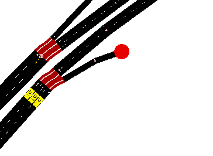

Thinking of calibrators and rerouters and how they will affect the final simulation
    Might want to set traffic with a plausible route. That way, it has already calculated where it needs to go and doesn't need to recalculate everything when it reaches a rerouter.
    Alternatively, the vehicles may not be given their final destination, but only the next step, before they can further be influenced by another rerouter on the way
About Rerouters
    They seem to be added to on top of the junction where the rerouting will happen. this might cause unexpected jams since vehicles will try to switch lanes to fast.
        
    An alternative, would be to have the vehicles one edge behind.
        Problem 1: could have too coordinate more than 1 rerouter for the sum of traffic
        Problem 2: As the live counts will inform the routers, the count-adjusted flows might be too delayed if the rerouting is done so far back.
        Possible solutions (that would have some caveats) redo the network by introducing a continuous junction at the position of the edge that we deem is far enough back to place the rerouter.
Did the script to get the edges at the end of which a vehicle has a choice to make (two or more edges they can go to)
Did the scripts that, from the choice edges, places rerouters in said edges.
FOr the cut edges and detector systems, made it to account for the 3 variants of cut edges: normal, continuous, and deducible. The results go into a folder
Script to determine which routers are deterministic (their flow can be inferred from other flows) or variable (their flow cannot be inferred from other flows)
